+++
title = "Gợi ý một số tựa sách cho người làm nghề nhân sự"
description = "Bản thân mình cũng làm việc với con người, cũng phải tìm hiểu, nghiên cứu sách vở để tham khảo, vậy nên mình xin liệt kê một số đầu sách theo quan điểm của mình có liên quan tới yếu tố con người và nhân sự, không ít thì nhiều hi vọng sẽ là một nguồn tài liệu tham khảo cho cả nhà."
date = 2023-04-07T03:28:00+07:00
slug = "Gợi ý một số tựa sách cho người làm nghề nhân sự"
draft = false

[taxonomies]
chuyen-muc = ["Phát Triển Bản Thân"]
the = ["Human Resource", "Book"]

[extra]
feature_image = "/bai-viet/goi-y-mot-so-tua-sach-cho-nguoi-lam-nghe-nhan-su/feature-image.jpg"

+++

Chuyện là tối hai hôm trước, đột nhiên nóc nhà bảo mình gợi ý mấy đầu sách để đọc về mảng nhân sự. Không biết ở công ty, sếp dí kiểu gì xong về dí mình, làm mình hoang mang mất ngủ quên cả nấu cơm. Mình thì có chuyên môn gì về nhân sự mà giới thiệu sách chứ, yêu cầu gì vô lý quá vậy????

<!-- more -->

Có điều với quan điểm người làm sản phẩm, có yêu cầu thì mình sẽ đề xuất giải pháp. Khách hàng này không bỏ mình được nhưng triệt tiêu doanh thu của mình nặng lắm.

Vậy nói về sách cho mảng nhân sự thì mình nên đề xuất thế nào cho hợp lý? Bản thân mình cũng làm việc với con người, cũng phải tìm hiểu, nghiên cứu sách vở để tham khảo, vậy nên mình xin liệt kê một số đầu sách theo quan điểm của mình có liên quan tới yếu tố con người và nhân sự, không ít thì nhiều hi vọng sẽ là một nguồn tài liệu tham khảo cho cả nhà.

## Top 5 theo quan điểm cá nhân của mình

### **First, Break All the Rules** 
***Marcus Buckingham và Curt Coffman***

"First, Break All the Rules" là một cuốn sách kinh điển trong lĩnh vực quản lý nhân sự, được viết bởi Marcus Buckingham và Curt Coffman. Cuốn sách này tập trung vào những nghiên cứu và kinh nghiệm về quản lý nhân sự của Gallup, một công ty nghiên cứu ý kiến ​​công chúng hàng đầu thế giới.

Buckingham và Coffman lấy cảm hứng từ những điều dễ thấy của các nhà quản lý xuất sắc và đưa ra những phương pháp quản lý nhân viên cực kỳ hiệu quả. Họ chỉ ra rằng, những quản lý tốt nhất không chỉ đơn thuần chỉ đạo, mà còn tạo ra một môi trường thúc đẩy sự phát triển của nhân viên.

Trong cuốn sách, tác giả đưa ra 12 quy tắc quản lý cơ bản và giải thích cách áp dụng chúng vào thực tế. Những quy tắc này bao gồm tập trung vào mục tiêu, đánh giá hiệu quả của nhân viên dựa trên đóng góp của họ, và khuyến khích nhân viên đóng góp ý kiến ​​của mình.

Cuốn sách cũng giải thích vì sao các tiêu chuẩn truyền thống trong quản lý nhân sự, chẳng hạn như đánh giá hiệu quả hàng năm, không phải là cách tốt nhất để đánh giá và phát triển nhân viên.

Đây là một cuốn sách rất giá trị với những người quản lý nhân sự và những người đang muốn học cách quản lý hiệu quả. Cuốn sách giúp bạn hiểu được những nguyên tắc cơ bản của quản lý và cách áp dụng chúng vào thực tế. Nó cũng đưa ra những cách tiếp cận mới để phát triển nhân viên, đồng thời hướng dẫn bạn tránh những sai lầm phổ biến trong quản lý nhân sự. 

**Túm lại thì, đây là một cuốn sách tuyệt vời mà bạn nên đọc để nâng cao kỹ năng quản lý của mình.**

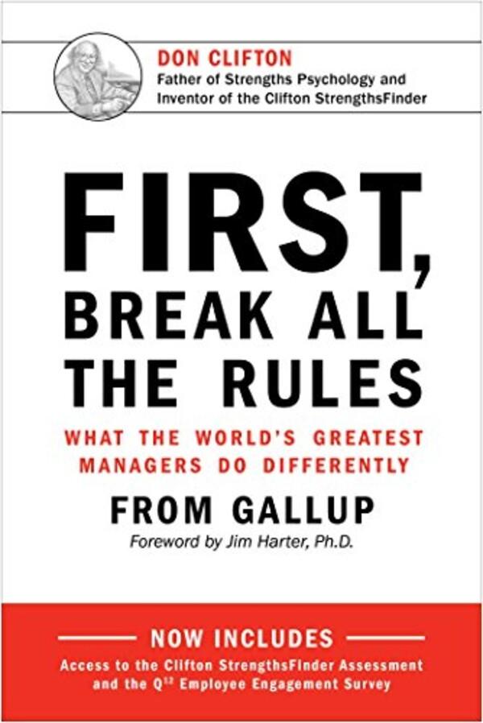

### **Crucial Conversations: Tools for Talking When Stakes Are High** 
***Kerry Patterson, Joseph Grenny, Ron McMillan và Al Switzler***

"Crucial Conversations: Tools for Talking When Stakes Are High" của Kerry Patterson, Joseph Grenny, Ron McMillan và Al Switzler là một cuốn sách hướng dẫn thực tiễn và linh hoạt, giúp bạn xử lý các cuộc trò chuyện khó khăn và quan trọng trong cuộc sống cá nhân và chuyên nghiệp.

Cuốn sách giải thích những nguyên tắc và kỹ năng để xử lý các cuộc trò chuyện quan trọng một cách hiệu quả, giữa các cá nhân, trong nhóm hoặc trong tổ chức. Tác giả giới thiệu một loạt các kỹ thuật giao tiếp nhằm giúp đối phó với tình huống mà tình cảm của bạn, hoặc của người khác, đang ảnh hưởng đến kết quả của cuộc trò chuyện.

Đây là một cuốn sách rất hữu ích và cần thiết cho bất kỳ ai muốn trở thành một người giao tiếp tốt hơn. Các tác giả cung cấp những bài học rất thực tiễn và lời khuyên có giá trị từ kinh nghiệm của họ, giúp người đọc hiểu rõ hơn về cách xử lý các cuộc trò chuyện quan trọng và khó khăn.

Cuốn sách cung cấp một phương pháp cụ thể để đối phó với các cuộc trò chuyện khó khăn, bằng cách sử dụng những kỹ thuật giao tiếp hiệu quả nhất. Từ đó, bạn sẽ tìm được cách giải quyết những vấn đề khó khăn trong cuộc sống và công việc, giúp cho các cuộc trò chuyện trở nên hiệu quả hơn và tạo nên sự đồng thuận trong nhóm hoặc tổ chức.

**Túm lại thì, "Crucial Conversations" là một cuốn sách giúp bạn phát triển kỹ năng giao tiếp và trở thành một người lãnh đạo tốt hơn, giúp bạn đạt được mục tiêu cá nhân và chuyên môn trong cuộc sống. Mà nhân sự thì chẳng phải giao tiếp rất quan trọng hay sao?**

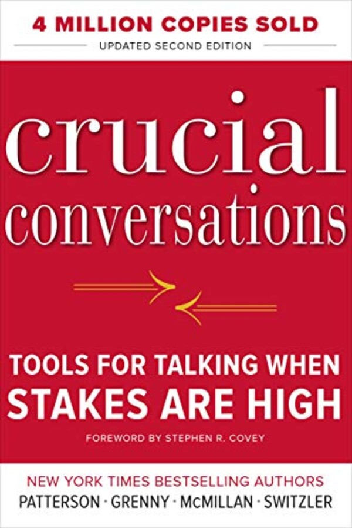

### **Radical Candor**
***Kim Scott***

Tựa sách "Radical Candor" của Kim Scott là một cuốn sách kinh điển về lãnh đạo và quản lý nhân sự, nó cung cấp cho độc giả một bộ công cụ hữu ích để tạo ra một môi trường làm việc năng suất và tràn đầy sáng tạo. Tác giả đề cập đến một khái niệm quan trọng trong lãnh đạo là "radical candor", tức là sự chân thành hoàn toàn trong cách thức đối xử và trao đổi giữa các thành viên trong nhóm.

Kim Scott sử dụng nhiều ví dụ thực tế và trải nghiệm cá nhân của mình để giúp cho người đọc hiểu được tầm quan trọng của việc thiết lập mối quan hệ chân thành giữa những người cấp dưới và cấp trên, tạo điều kiện cho sự phát triển của mỗi cá nhân cũng như đội nhóm trong tổ chức.

Cuốn sách này giúp người đọc hiểu được tầm quan trọng của một môi trường làm việc chân thành, cũng như cung cấp cho độc giả một loạt các kỹ năng để thực hiện điều đó. Kim Scott đưa ra những lời khuyên và hướng dẫn cụ thể, từ việc đưa ra phản hồi đến việc quản lý mối quan hệ giữa các nhân viên và cấp trên.

Một điểm đáng chú ý trong cuốn sách này là cách tác giả áp dụng các khái niệm trừu tượng vào thực tiễn, đặc biệt là việc giải quyết các vấn đề thực tế trong công việc hàng ngày. 

**Túm lại tiếp, theo quan điểm của mình thì "Radical Candor" là một cuốn sách đáng đọc không chỉ cho người quản lý và lãnh đạo, mà còn cho tất cả mọi người trong tổ chức.**

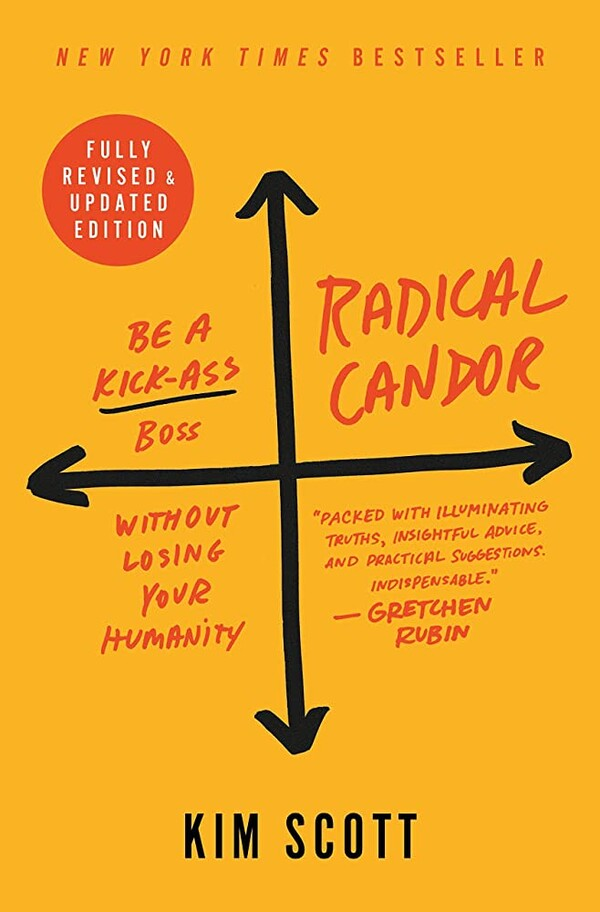

### **Leaders Eat Last**
***Simon Sinek***

Simon Sinek là một nhà diễn thuyết, tác giả và nhà tư vấn người Anh. Ông đã viết nhiều cuốn sách nổi tiếng về lãnh đạo và quản lý, trong đó có "Start with Why" và "Leaders Eat Last". Sinek được biết đến với phong cách truyền đạt đầy cảm hứng và thông qua việc trình bày các ý tưởng và ví dụ minh họa sống động, ông giúp người đọc và người nghe hiểu được sâu sắc hơn về cách lãnh đạo và quản lý có thể tạo ra những thay đổi tích cực và lâu dài trong tổ chức và cuộc sống của con người. Sinek cũng là một diễn giả được yêu thích và đã được mời phát biểu tại nhiều sự kiện và hội thảo trên toàn thế giới. Do mình cũng hay theo dõi các chia sẻ của ông nên khúc này thì lại nói về ông nhiều hơn một tí.

"Leaders Eat Last" là một cuốn sách nổi tiếng của Simon Sinek, được xuất bản năm 2014, nói về cách lãnh đạo tốt có thể tạo ra môi trường làm việc tích cực và thành công cho nhân viên và tổ chức. Tác giả đưa ra những bài học quý giá về quản lý, tập trung vào việc xây dựng một văn hóa làm việc đúng cách, đưa ra nhiều ví dụ thực tế để minh họa cho các nguyên tắc quản lý nhân sự.

Trong cuốn sách, Simon Sinek giải thích rằng lãnh đạo tốt không chỉ là việc giám sát và quản lý nhân viên, mà còn là việc tạo ra một môi trường làm việc lành mạnh, nơi mà nhân viên cảm thấy được yêu thương và trân trọng. Ông giải thích rằng lãnh đạo đích thực là người đứng ra bảo vệ nhân viên của mình, đặt họ lên hàng đầu, thay vì chỉ tập trung vào các chỉ tiêu kinh doanh và lợi nhuận. Tác giả cũng đưa ra các phương pháp và công cụ để tạo ra một môi trường làm việc tốt, cũng như giải thích tại sao những chiến lược này rất quan trọng đối với sự phát triển của tổ chức.

Phần liên quan tới quản lý nhân sự của cuốn sách rất đáng chú ý và giá trị, đặc biệt là những chương về cách xây dựng một văn hóa làm việc lành mạnh, tạo sự đồng cảm và sự tin tưởng giữa lãnh đạo và nhân viên, và cách để phát triển nhân viên. Cuốn sách này giúp người đọc hiểu rõ hơn về vai trò của quản lý nhân sự trong việc tạo ra một tổ chức thành công và một môi trường làm việc tích cực.

**Túm lại tiếp nữa, "Leaders Eat Last" là một cuốn sách rất đáng đọc cho những người quản lý, những người muốn trở thành lãnh đạo tốt hơn, tạo ra một môi trường làm việc lành mạnh và phát triển nhân viên.**

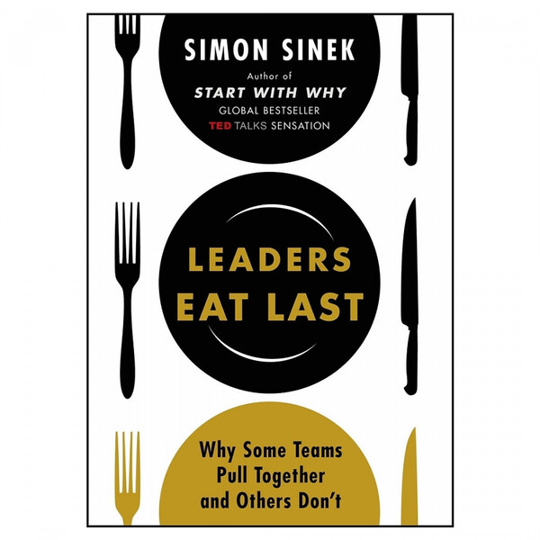

### **The 7 Habits of Highly Effective People**
***Stephen Covey***

"The 7 Habits of Highly Effective People" là một trong những cuốn sách kinh điển về phát triển bản thân và quản lý được viết bởi Stephen Covey. Cuốn sách này giúp độc giả tìm hiểu về 7 thói quen của những người thành công và cách áp dụng chúng vào cuộc sống và công việc của mình. Tác giả đề cao tầm quan trọng của việc phát triển bản thân và kết nối với những người xung quanh, từ đó đạt được thành công bền vững.

Trong cuốn sách, Covey đề cập đến những kỹ năng quản lý nhân sự quan trọng như giao tiếp hiệu quả, lắng nghe, đưa ra phản hồi xây dựng và thiết lập các mục tiêu rõ ràng và đo lường được. Ông cũng nhấn mạnh tầm quan trọng của việc xây dựng một môi trường làm việc tích cực và tạo điều kiện cho nhân viên phát triển bản thân, đóng góp và cảm thấy động lực để làm việc.

Đây là một trong những cuốn sách quản lý và phát triển bản thân được đánh giá cao nhất trong lĩnh vực này. Cuốn sách cung cấp cho người đọc một cái nhìn toàn diện về cách phát triển bản thân và tạo ra thành công bền vững. Tuy nhiên, một số độc giả cho rằng sách này khá dày và nhiều phần trừu tượng, không phù hợp với những người đọc muốn tìm hiểu các kỹ năng quản lý cụ thể. Tuy vậy, nếu bạn muốn tìm hiểu về cách xây dựng một sự nghiệp và cuộc sống đầy ý nghĩa, thì cuốn sách này sẽ rất hữu ích cho bạn.

Việc đưa tựa sách nào vào danh sách top 5 phần nhiều chính là quan điểm cá nhân của mình, bởi đây là một trong những tựa sách đầu tiên mình đọc trong những năm tháng học phổ thông, ở những buổi đầu bắt đầu lân la tới thư viện trường và mê cái sự đọc. Thêm vào đó, rất nhiều năm sau, một mentor của mình lại tặng mình chính cuốn sách này. Mình hy vọng sự cảm tính này sẽ không khiến mình quá sai khi đưa tựa sách nào vào vị trí thứ 5.

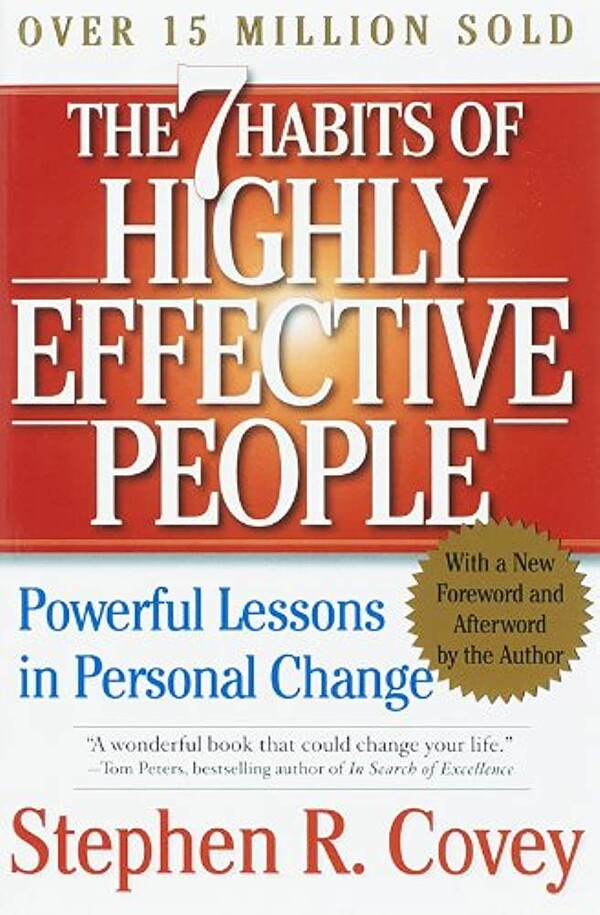

## Các tựa sách gợi ý khác, không sắp xếp theo thứ tự nào cả

### **The Culture Code**
***Daniel Coyle***

"The Culture Code" là một cuốn sách của tác giả Daniel Coyle, một nhà báo và tác giả nổi tiếng, chuyên nghiên cứu về cách tạo dựng và duy trì văn hóa trong tổ chức. Cuốn sách này cung cấp cho người đọc những kiến thức và kinh nghiệm từ những tổ chức hàng đầu thế giới như Pixar, Google, SEAL Team Six, IDEO và U.S. Steel, giúp đưa ra những cách tiếp cận đột phá trong việc xây dựng và phát triển văn hóa tổ chức.

Văn hóa tổ chức là yếu tố rất quan trọng trong việc quản lý nhân sự, và "The Culture Code" là một cuốn sách đáng đọc cho những người quản lý và lãnh đạo mong muốn tạo dựng một văn hóa tích cực trong tổ chức của mình. Tác giả Daniel Coyle đã đưa ra những chia sẻ bổ ích và cụ thể về cách tạo dựng và phát triển văn hóa trong tổ chức, dựa trên nghiên cứu và phân tích từ nhiều tổ chức lớn trên thế giới.

Cuốn sách được viết một cách rất dễ hiểu, đưa ra các ví dụ cụ thể và những câu chuyện thú vị để minh họa cho các khái niệm. Ngoài ra, tác giả còn đưa ra những bài học quý giá từ những tổ chức thành công về cách tạo dựng môi trường làm việc tích cực và phát triển các giá trị cốt lõi trong tổ chức.

Với những lời khuyên và kinh nghiệm được đưa ra trong "The Culture Code", cuốn sách này giúp cho người đọc hiểu rõ hơn về tầm quan trọng của văn hóa tổ chức và những cách tiếp cận hiệu quả để tạo dựng và phát triển văn hóa tích cực trong tổ chức.

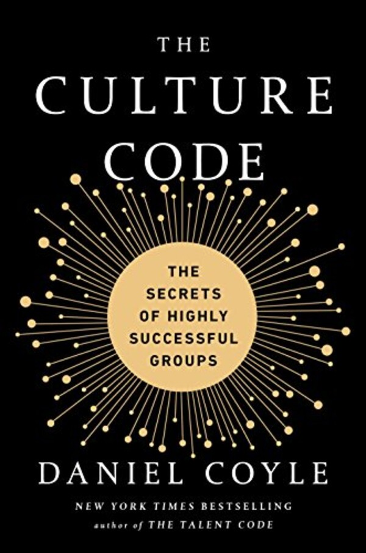

### **The Talent Code**
*cũng của **Daniel Coyle***

"The Talent Code" là một cuốn sách viết về việc phát triển tài năng và kỹ năng thông qua việc huấn luyện. Tác giả Daniel Coyle đã điều tra và tìm hiểu các khu vực trên thế giới, nơi các huấn luyện viên và giáo viên đã sản xuất ra những tài năng hàng đầu. Qua quá trình nghiên cứu, ông đã phát hiện ra rằng, những người có tài năng xuất chúng không chỉ đơn giản là may mắn hoặc có năng khiếu bẩm sinh, mà chính bởi họ đã trải qua quá trình huấn luyện tập trung và có hệ thống.

Cuốn sách chia sẻ về những phát hiện của tác giả, cùng với các kỹ thuật và chiến lược để phát triển tài năng và kỹ năng trong một môi trường tập thể. Nó cũng chứa đựng những bài học quan trọng về quản lý nhân sự. Tác giả cho thấy rằng việc phát triển tài năng và kỹ năng của nhân viên đòi hỏi sự tập trung và chăm sóc đặc biệt. Các ví dụ về cách các huấn luyện viên và giáo viên đạt được thành công trong việc phát triển tài năng của học viên thông qua việc xây dựng một môi trường đào tạo tốt được đưa ra.

Tác giả cũng đưa ra một số nguyên tắc quan trọng để quản lý nhân sự, bao gồm tạo ra môi trường làm việc có cảm giác an toàn và hỗ trợ, đảm bảo việc đánh giá công bằng và xây dựng một môi trường học tập và phát triển.

Đây là một cuốn sách đáng đọc để hiểu rõ hơn về quá trình phát triển tài năng và kỹ năng, và cung cấp một số bài học và chiến lược quan trọng cho quản lý nhân sự. Các ví dụ trong cuốn sách rất đa dạng và thú vị, giúp người đọc dễ dàng áp dụng những bài học vào thực tế. Tuy nhiên, cuốn sách có thể khá tập trung vào việc đưa ra các kỹ thuật cụ thể để phát triển tài năng, có thể không phù hợp với một số người đọc muốn tìm hiểu về các khía cạnh khác của quản lý nhân sự. Ngoài ra, cuốn sách cũng chưa đề cập đến những thách thức và khó khăn khi triển khai các chiến lược này trong thực tế, nên cả nhà cần lưu ý khi đọc tựa sách này nhé.

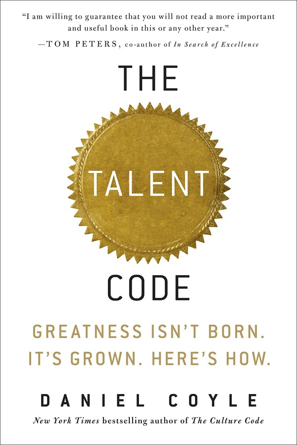

### **Good to Great**
***Jim Collins***

"Good to Great" của Jim Collins là một trong những cuốn sách quản lý kinh doanh được đánh giá cao nhất. Cuốn sách phân tích tầm quan trọng của việc xây dựng một doanh nghiệp từ tốt đến đỉnh cao vượt trội. Jim Collins đã tiến hành nghiên cứu 5 năm trên 28 công ty trong các ngành khác nhau và tìm ra những yếu tố chung của các công ty đã trở nên vượt trội trong một thời gian dài.

Phần liên quan đến quản lý nhân sự, tác giả nhấn mạnh rằng để xây dựng một công ty vượt trội, người lãnh đạo cần phải tập trung vào việc tìm kiếm và phát triển nhân tài. Cuốn sách cung cấp những lời khuyên quan trọng cho các nhà quản lý, giúp họ tìm ra và thu hút những nhân tài có thể đưa doanh nghiệp đến thành công.

Đây là một trong những cuốn sách kinh doanh được đánh giá cao nhất trong những năm qua. Tác giả đã thực hiện một nghiên cứu cụ thể và tìm ra những yếu tố chung của các công ty vượt trội, đưa ra những kiến thức quan trọng giúp các nhà quản lý tìm ra và phát triển nhân tài. Ngoài ra, tác giả cũng đưa ra nhiều chiến lược quản lý khác nhau để giúp các doanh nghiệp phát triển và vươn tới đỉnh cao.

Mặc dù đây không phải là một tựa sách dễ đọc nếu xét trên góc độ thuần túy của người làm về nhân sự, nhưng nó chứa đựng những kiến thức thực tiễn rất hữu ích và áp dụng được trong các doanh nghiệp. Đây là cuốn sách không thể thiếu đối với các nhà quản lý và những người muốn xây dựng một công ty thành công.

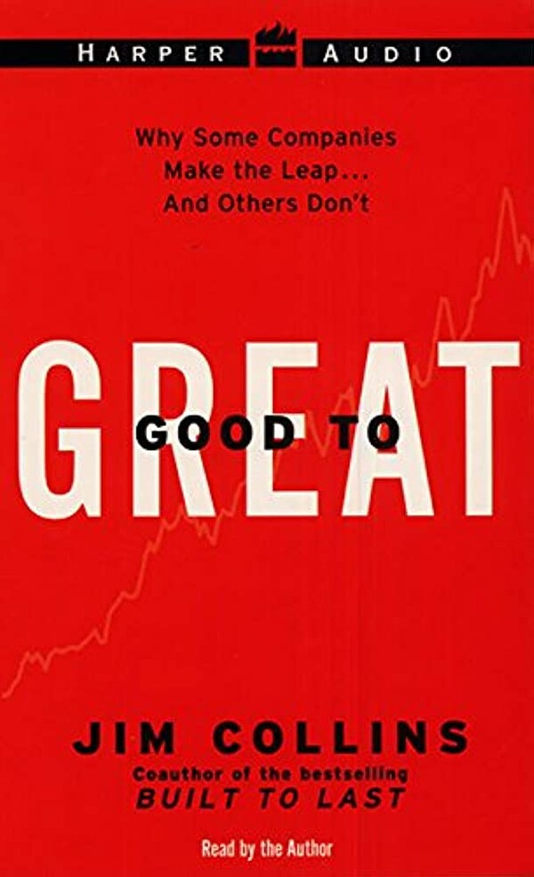

### **Drive: The Surprising Truth About What Motivates Us**
***Daniel Pink***

"Drive: The Surprising Truth About What Motivates Us" của Daniel Pink là một cuốn sách nghiên cứu về động lực học và cách những yếu tố tác động đến động lực của con người. Cuốn sách này không chỉ đưa ra những phân tích sâu sắc về sự khác biệt giữa động lực nội tại và động lực bên ngoài, mà còn giúp người đọc hiểu rõ hơn về cách thức để tạo động lực cho nhân viên.

Sách bắt đầu với việc đưa ra khái niệm về động lực nội tại và động lực bên ngoài. Tác giả phân tích sâu sắc những yếu tố cơ bản của động lực nội tại, bao gồm sự thỏa mãn, sự phát triển và sự thực hiện mục tiêu. Sách cũng giải thích rõ ràng về cách thức tạo ra động lực nội tại bằng cách tăng cường khả năng tự chủ, phát triển kỹ năng và sự hài lòng trong công việc.

Tác giả cũng nghiên cứu những yếu tố ảnh hưởng đến động lực của nhân viên, bao gồm tiền lương, danh tiếng và sự thú vị của công việc. Tuy nhiên, ông cho rằng các yếu tố này chỉ mang tính tạm thời và không thể tạo ra động lực bền vững cho nhân viên. Bản thân mình trước đây cũng từng có cơ hội theo học những khóa về Executive Management và Motivation, nên những quan điểm này của tác giả mình rất là đồng tình.

Đây là một cuốn sách giúp người đọc hiểu rõ hơn về cách thức để tạo động lực cho nhân viên. Tác giả Daniel Pink cung cấp những kiến thức giá trị về động lực nội tại và các yếu tố ảnh hưởng đến động lực của nhân viên. Cuốn sách rất hữu ích cho các nhà quản lý và chủ doanh nghiệp muốn tạo ra một môi trường làm việc đầy đủ động lực và tạo đột phá trong công việc.

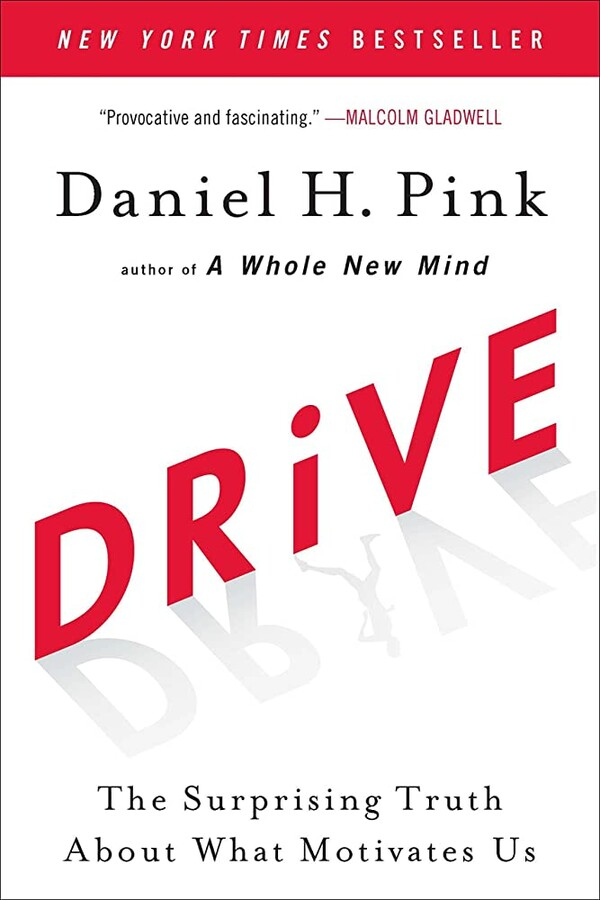

### **The Effective Executive**
***Peter Drucker***

Tác phẩm cổ điển "The Effective Executive" của Peter Drucker là một trong những cuốn sách kinh điển về quản lý và lãnh đạo. Được xuất bản lần đầu vào năm 1967, cuốn sách này đã trở thành một nguồn cảm hứng và tư liệu quan trọng cho các nhà quản lý và lãnh đạo trong hơn nửa thế kỷ qua. Peter Drucker được coi là cha đẻ của ngành quản trị học hiện đại, và cho đến năm 2006, cuốn sách trên của tác giả mới được tái bản. Và sau đó mình mới có cơ hội tiếp cận bản mới này, chứ hồi đó trẻ trâu, chê sách xưa lắm.

Trong cuốn sách, tác giả Peter Drucker tập trung vào cách để trở thành một nhà lãnh đạo hiệu quả, thúc đẩy nhân viên và tạo ra giá trị cho tổ chức. Bằng cách đưa ra những khái niệm cơ bản về quản lý, Drucker giúp đọc giả hiểu rõ hơn về vai trò của một nhà quản lý và cách thức để hoàn thành tốt công việc.

"The Effective Executive" của Peter Drucker được đánh giá là một trong những cuốn sách nên đọc đối với bất kỳ nhà quản lý và lãnh đạo nào. Những khái niệm quản lý cơ bản được Drucker đưa ra vẫn luôn được áp dụng trong thực tế công việc. Từ cách quản lý thời gian đến cách tạo động lực cho nhân viên, cuốn sách này đề cập đầy đủ các chủ đề quan trọng mà một nhà quản lý cần nắm vững.

Ngoài ra, cuốn sách cũng cung cấp nhiều ví dụ minh họa và kinh nghiệm thực tiễn giúp người đọc áp dụng được các khái niệm vào thực tế công việc. Điều này giúp cuốn sách trở thành một nguồn tài liệu vô giá cho các nhà quản lý và lãnh đạo muốn nâng cao kỹ năng và hiểu biết về quản lý.

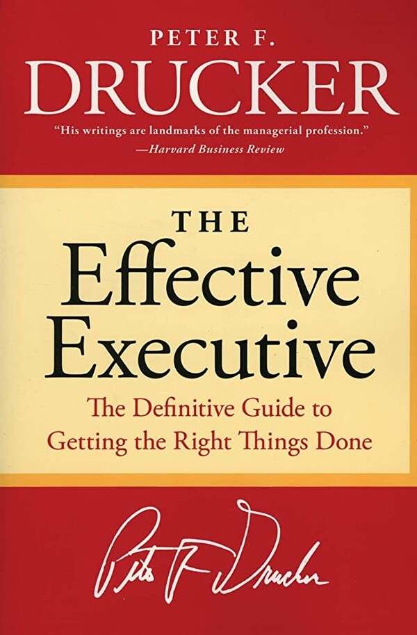

### **Work Rules!: Insights from Inside Google That Will Transform How You Live and Lead**
***Laszlo Bock***

"Work Rules!: Insights from Inside Google That Will Transform How You Live and Lead" là một cuốn sách viết về quản lý nhân sự dựa trên những kinh nghiệm thực tế từ bên trong Google, được viết bởi Laszlo Bock - người từng đứng đầu bộ phận quản lý nhân sự của Google. Tác giả chia sẻ những kiến thức và kinh nghiệm về việc tạo ra một môi trường làm việc tích cực và cải thiện hiệu quả của công việc.

Cuốn sách này đưa ra những phương pháp cụ thể để giúp các nhà quản lý tạo ra một môi trường làm việc tốt hơn cho nhân viên, đồng thời cải thiện hiệu quả hoạt động của tổ chức. Tác giả phân tích những chính sách và quy trình của Google, bao gồm cách tuyển dụng, đánh giá, đào tạo, lương bổng và phúc lợi, và cung cấp những lời khuyên và bài học giá trị cho những người muốn cải thiện quản lý nhân sự của mình.

Đây là một cuốn sách rất đáng đọc về quản lý nhân sự, đặc biệt là đối với những người quản lý hoặc những ai đang tìm cách tạo ra một môi trường làm việc tốt hơn cho nhân viên của mình. Tác giả cung cấp những kiến thức chuyên sâu từ bên trong Google, một trong những công ty nổi tiếng nhất về quản lý nhân sự và môi trường làm việc tích cực.

Cuốn sách dễ đọc và có nhiều thông tin bổ ích. Tác giả cung cấp nhiều ví dụ cụ thể và hình ảnh sinh động để minh họa những chính sách và quy trình của Google, giúp người đọc hiểu rõ hơn về cách một công ty có thể tạo ra một môi trường làm việc tích cực. Cuốn sách cũng đưa ra nhiều lời khuyên hữu ích cho các nhà quản lý về cách tuyển dụng, đào tạo và đánh giá nhân viên, cũng như cách tạo ra một bầu không khí tích cực cho nhân viên của mình.

Do vậy, đây là một cuốn sách quản lý nhân sự đáng đọc với nhiều kiến thức chuyên sâu từ bên trong Google. Cuốn sách cung cấp nhiều phương pháp và lời khuyên cụ thể để giúp người đọc tạo ra một môi trường làm việc tích cực và cải thiện hiệu quả hoạt động của tổ chức. Với nhiều ví dụ và hình ảnh sinh động, cuốn sách giúp người đọc hiểu rõ hơn về cách một công ty thành công như Google có thể tạo ra một môi trường làm việc tốt cho nhân viên.

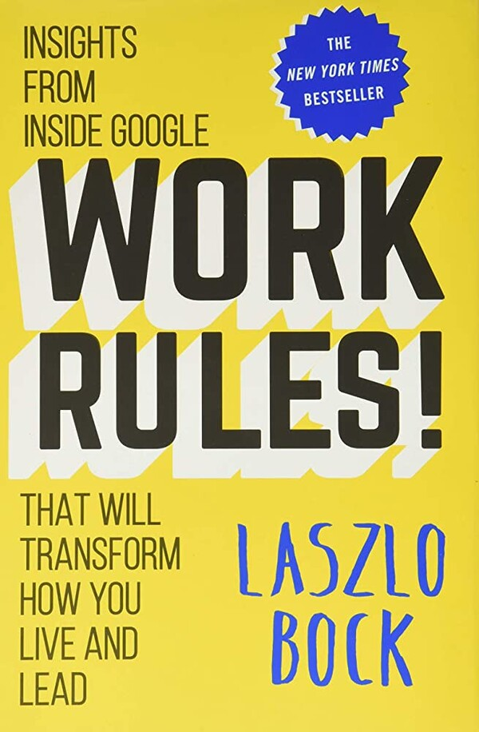

### **The Lean Startup**
***Eric Ries***

"The Lean Startup" là một cuốn sách viết bởi Eric Ries, một nhà phát triển và doanh nhân người Mỹ, tập trung vào phương pháp khởi nghiệp tối giản và quản lý dự án tối ưu hóa. Cuốn sách đã có ảnh hưởng lớn đối với ngành công nghiệp khởi nghiệp và được đánh giá là một trong những cuốn sách kinh doanh quan trọng nhất của thế kỷ 21.

Cuốn sách tập trung vào việc tạo ra các sản phẩm chất lượng cao với chi phí thấp hơn và giảm thiểu rủi ro thất bại. Nó cung cấp những kỹ thuật quản lý dự án và tư duy khởi nghiệp được trình bày rõ ràng và được minh họa bằng những ví dụ thực tế.

"The Lean Startup" giúp cho các nhà khởi nghiệp và quản lý dự án hiểu được tầm quan trọng của việc tối giản hóa chi phí và thời gian trong quá trình phát triển sản phẩm, tạo ra giá trị cho khách hàng và đưa sản phẩm đến thị trường nhanh chóng. Với những người quản lý nhân sự, nó cung cấp một góc nhìn mới về cách tiếp cận với các dự án phát triển sản phẩm, bao gồm tạo ra môi trường làm việc sáng tạo và khuyến khích nhân viên tư duy ngoại cảm để đưa ra những giải pháp tối ưu. Cuốn sách cũng cho thấy sự cần thiết của việc áp dụng phương pháp thử và sai trong quá trình phát triển sản phẩm, giúp nhân viên học hỏi và phát triển kỹ năng của mình.

Mặc dù "The Lean Startup" tập trung vào phương pháp khởi nghiệp tối giản và quản lý dự án tối ưu hóa, việc quản lý tài nguyên con người vẫn là một yếu tố quan trọng trong quá trình triển khai phương pháp Lean Startup. Nhân sự cần được đưa vào các quyết định liên quan đến sản phẩm và dịch vụ và phải có sự hợp tác chặt chẽ để đạt được các mục tiêu của phương pháp Lean Startup. Cuốn sách cũng đề cập đến việc quản lý rủi ro trong khởi nghiệp, một trong những rủi ro lớn nhất là quản lý tài nguyên con người. Qua đó, cuốn sách cũng cung cấp cho các nhà quản lý nhân sự góc nhìn về quản lý tài nguyên con người một cách hiệu quả hơn trong quá trình triển khai phương pháp Lean Startup.

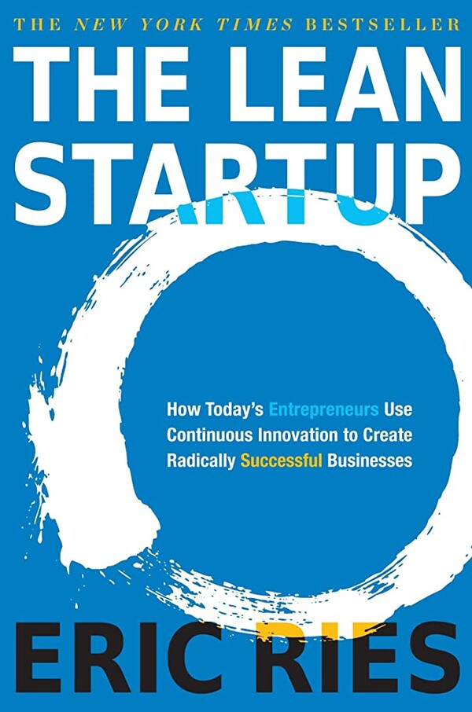

**HẾT RỒI CẢ NHÀ ƠI!**

Cảm ơn cả nhà đã đọc qua!